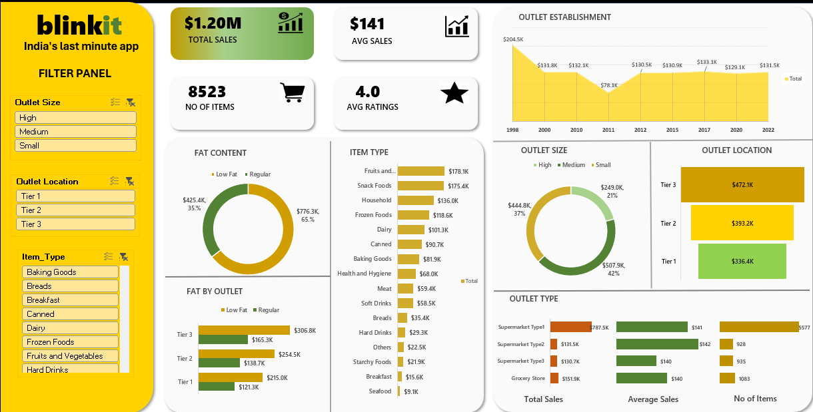

# Blinkit Sales Performance Dashboard – Excel Project

This project is a complete end-to-end Excel dashboard designed to analyze Blinkit’s sales performance, customer satisfaction, and inventory distribution. The goal was to explore how different factors—such as fat content, outlet size, item type, and geographic location—impact overall sales and key business metrics.

## Project Overview

Retail datasets are often large and complex, and making sense of them requires a structured analytical approach.  
In this project, I built an interactive Excel dashboard that brings together multiple KPIs and visual insights to help stakeholders quickly understand:

- What products sell the most  
- How customer ratings influence performance  
- How outlet characteristics affect revenue  
- How sales vary across categories like fat content, size, item type, and location  

The dashboard allows decision-makers to slice and filter the data without touching the raw dataset.

## Business Requirement

The primary objective was to analyze Blinkit’s sales dataset and uncover insights that could help optimize product assortment, pricing strategies, and outlet performance.

The analysis includes:

- Identifying top-performing product categories  
- Understanding sales variation across outlets  
- Measuring customer satisfaction using average ratings  
- Observing how outlet age, size, and type influence revenue  

All insights are visualized using clean and intuitive Excel charts.

## Key Performance Indicators (KPIs)

- **Total Sales:** $1.20M  
- **Average Sales per Item:** $141  
- **Number of Items Sold:** 8,523  
- **Average Customer Rating:** 4.0  

## Dashboard Visuals & Insights

### 1. Total Sales by Fat Content
Helps understand how low-fat vs regular-fat products contribute to overall revenue.
- Low Fat: $776.3K
- Regular: $425.4K 

### 2. Total Sales by Item Type
Identifies which categories drive the highest revenue.
Top categories include:
- Fruits & Vegetables – **$178.1K**  
- Snack Foods – **$175.4K**  
- Household Items – **$136.0K**
This helps in inventory planning and promotional focus.

### 3. Fat Content by Outlet
Breaks down fat-based sales across Tier 1, Tier 2, and Tier 3 outlets.
Tier 3 outlets perform the strongest, especially in low-fat items.

### 4. Total Sales by Outlet Establishment Year
Shows how the age of an outlet correlates with revenue.
Outlets established in **1998** and **2017** show comparatively higher performance..

### 5. Sales by Outlet Size
Medium-sized outlets lead with $507.9K, followed by small and high-capacity stores.

### 6. Sales by Outlet Location
Tier 3 outlets outperform others with $472.1K, indicating stronger demand in those regions. 

### 7. All Metrics by Outlet Type
A consolidated view of total sales, average sales and number of items for each outlet type.
Supermarket Type1 contributes the majority: $787.5K in sales.

## Interactive Slicers Added
To make the dashboard user-friendly, slicers were included for:
- Outlet Size  
- Outlet Location  
- Item Type  
These allow stakeholders to filter and analyze specific segments instantly.
 
## Dashboard Preview

 
